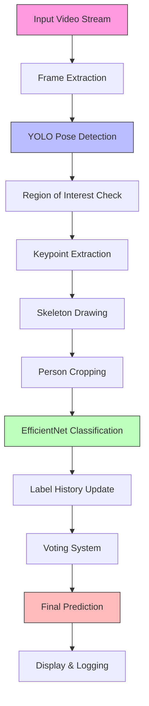

# Hệ Thống Giám Sát Hoạt Động Công Nhân Sử Dụng YOLO và EfficientNet

## 📝 Tổng Quan
Hệ thống được phát triển để giám sát hoạt động của công nhân trong khu vực làm việc, sử dụng kết hợp giữa YOLO pose estimation và phân loại hành vi với EfficientNet. Hệ thống có khả năng phát hiện và phân loại trạng thái làm việc của công nhân trong thời gian thực.

## 🔄 Luồng Xử Lý Chi Tiết



## Các Thành Phần Chính

### 1. Phát Hiện Pose (YOLO)
- Sử dụng YOLO11m-pose để phát hiện người và các keypoint
- Độ tin cậy ngưỡng: 0.3
- 17 keypoint cho mỗi người
- Vẽ skeleton kết nối các điểm keypoint

### 2. Vùng Quan Sát
- Định nghĩa vùng quan sát bằng 4 điểm tọa độ
- Kiểm tra người trong/ngoài vùng quan sát
- Chỉ xử lý đối tượng trong vùng được định nghĩa

### 3. Mô Hình Phân Loại (EfficientNetB2)
- Pretrained EfficientNetB2 với fine-tuning
- 2 lớp đầu ra: working/not_working
- Cấu trúc head tùy chỉnh:
  - Linear(in_features -> 256)
  - BatchNorm + ReLU + Dropout
  - Linear(256 -> 128)
  - BatchNorm + ReLU + Dropout
  - Linear(128 -> 2)

### 4. Xử Lý Dự Đoán
- Lưu lịch sử 20 frame gần nhất cho mỗi người
- Cập nhật dự đoán mỗi 20 frame
- Sử dụng voting để đưa ra kết quả cuối cùng

## Cài Đặt và Yêu Cầu

### Yêu Cầu Hệ Thống
- Python 3.9+
- CUDA support (khuyến nghị)
- RAM: 8GB+

### Cấu Trúc Thư Mục

```Readme.md
├── model/
│   ├── yolo11m-pose.engine
│   └── best_efficientnetb2.pth
├── data/
│   └── videos/
├── dataset_split/
│   ├── train/
│   │   ├── working/
│   │   └── not_working/
│   └── test/
│       ├── working/
│       └── not_working/
└── test_pose/
    ├── main.py
    ├── test.py
    └── 10_frame.py
```

## Kết Quả
- Độ chính xác phân loại: ~98%
- F1-score: 1.0
- FPS trung bình: 40-50 (với GPU)

## Hướng Dẫn Sử Dụng

1. Chạy chương trình:
```bash
python test_pose/10_frame.py
```

2. Điều chỉnh vùng quan sát:
```bash
python cover/ve_vung.py
```

## Lưu Ý
- Cần điều chỉnh vùng quan sát phù hợp với góc camera
- Có thể điều chỉnh ngưỡng tin cậy của YOLO tùy theo điều kiện ánh sáng
- Nên sử dụng GPU để đạt hiệu suất tốt nhất

## Tính Năng Nâng Cao
- Lưu trữ lịch sử hoạt động
- Smooth prediction với voting system
- Tự động điều chỉnh độ tin cậy
- Xử lý đa luồng cho hiệu suất cao


